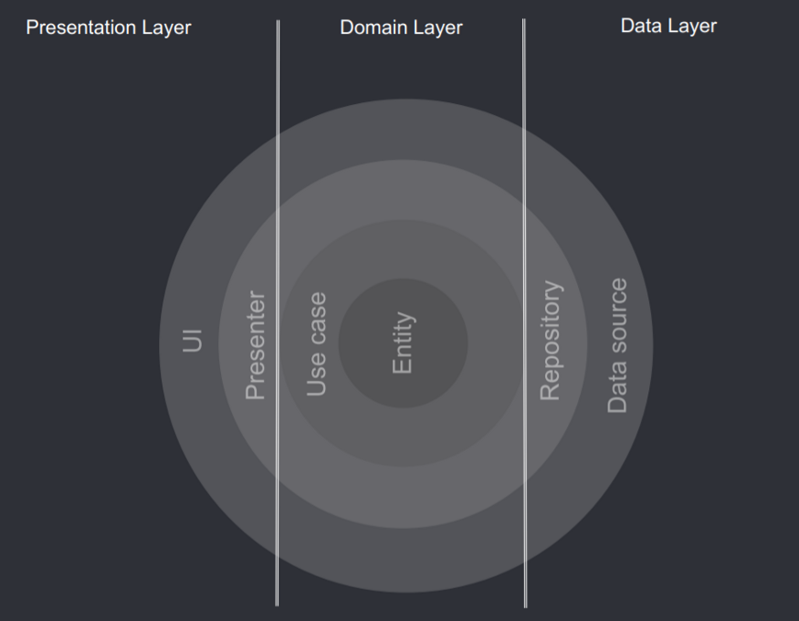

# github_stars

A new Xerpa application.

## Getting Started

## Building
`flutter pub get` for the first time. This ensures that you get the same package version again if you, or
another developer, run flutter pub get.

## Code style

I use the default dart code style.

## Architecture

I divide my layers as the clean architecture says, as follow:

and in my presentation, i use BLoC to manage the state.

## Test
`flutter test` to run all tests.